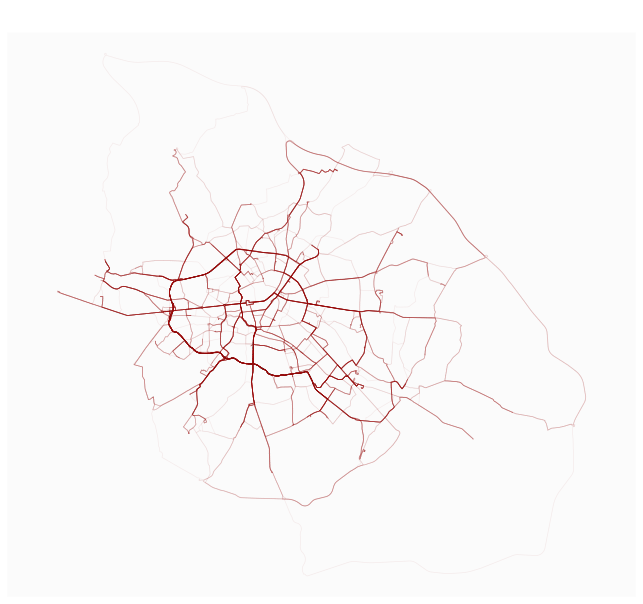

# Batchvalh

Batch route operation for Valhalla API (this is [https://github.com/rcarto/batchosrm](https://github.com/rcarto/batchosrm) adapted to Valhalla).

If you arrived here by mistake, perhaps you are looking for the [valh](https://github.com/riatelab/valh/) package, which provides an interface to the Valhalla Web API (since `batchvalh` is only about being able to send route calculations in parallel, avoiding the overhead of repeated calls to `valh::vl_route`).

## Installation

You can install the development version of batchvalh with:

``` r
remotes::install_github("mthh/batchvalh")
```


## Example

```r
library(batchvalh)
library(tictoc)
library(mapsf)

# Build a large dataset of origins and destination from valh package sample dataset
apt <- read.csv(system.file("csv/apotheke.csv", package = "valh"))
set.seed(42)
o <- sample(1:100, 1000, replace = T)
set.seed(666)
d <- sample(1:100, 1000, replace = T)
x <- cbind(apt[o, c(2:3)], apt[d, c(2:3)])
row.names(x) <- 1:nrow(x)

# Query duration, distance and geometry
tic()
r <- routes(x, nc = 8, nq = 50, server = "http://0.0.0.0:8002/", profile = "auto")
toc()
#> 20.769 sec elapsed

mf_map(r, col = "#94000010", lwd = 1)
```

